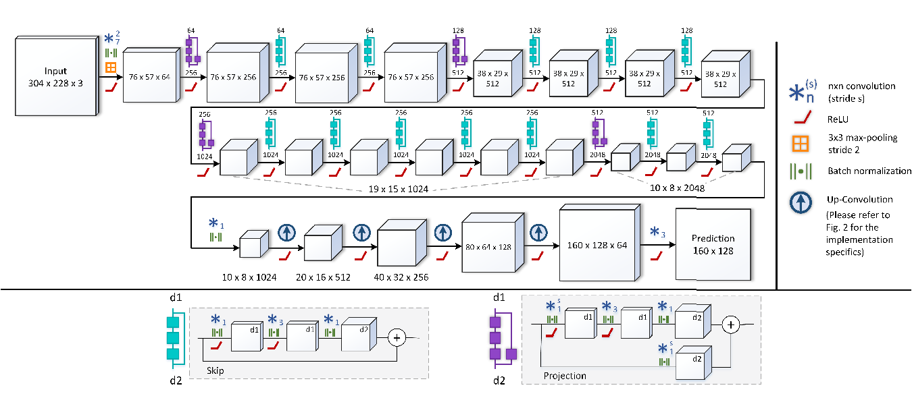

# FCRN-PyTorch
PyTorch implementation of Fully Convolutional Residual Networks(FCRN).
The paper can be found [here](https://arxiv.org/pdf/1606.00373.pdf)
  

## Usage
### Training
``
python train.py --arg=parameter
``
##### Args:
--cuda
use GPU to train

--batch_size:
type:int 
batch size

--epoch_num
type:int
number of epoch

--learing_rate
type:float
Initial learning rate

--load_checkpoint=x
type:int
Start trainging from epoch x

--load_file=('parameter.pth', 'optimizer.pth')
type:tuple
Loading parameters from a specific file
